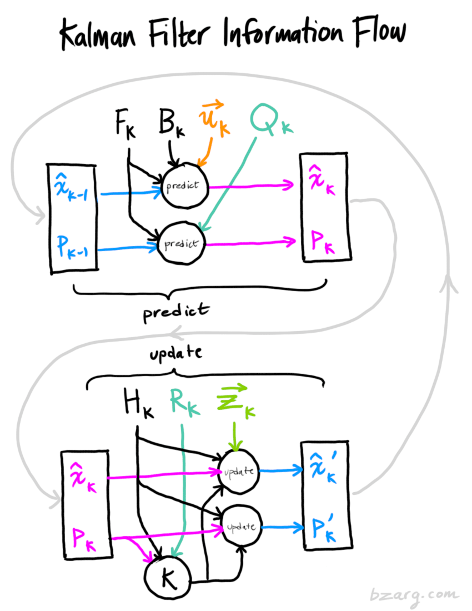

# Kalman filtering GPS data and Accelerometer data

k: time  
x&#770;k-1: best estimate at k-1 time  
Pk-1: covariance matrix at k-1 time  
Fk: prediction matrix which takes every point in our original estimate and moves it to a new predicted location, which is where the system would move if that original estimate was the right one  
Bk: control matrix which represents some changes that aren't related to the state itself - external influence  
u&#8407;k: control vector which represents additional information about what’s going on in the world  
Qk: noise covariance matrix 
x&#770;k: best estimate at k time  
Pk: covariance matrix at k time  
Hk: noise covariance matrix  
Rk: covariance matrix of uncertainty  
z&#8407;k: mean equal to the reading we observed  
x&#770;'k: best estimate produced after update and which will be the k-1 in the next step  
P'k: covariance matrix produced after update and which will be the k-1 in the next step  

Reference documentation: https://www.bzarg.com/p/how-a-kalman-filter-works-in-pictures/